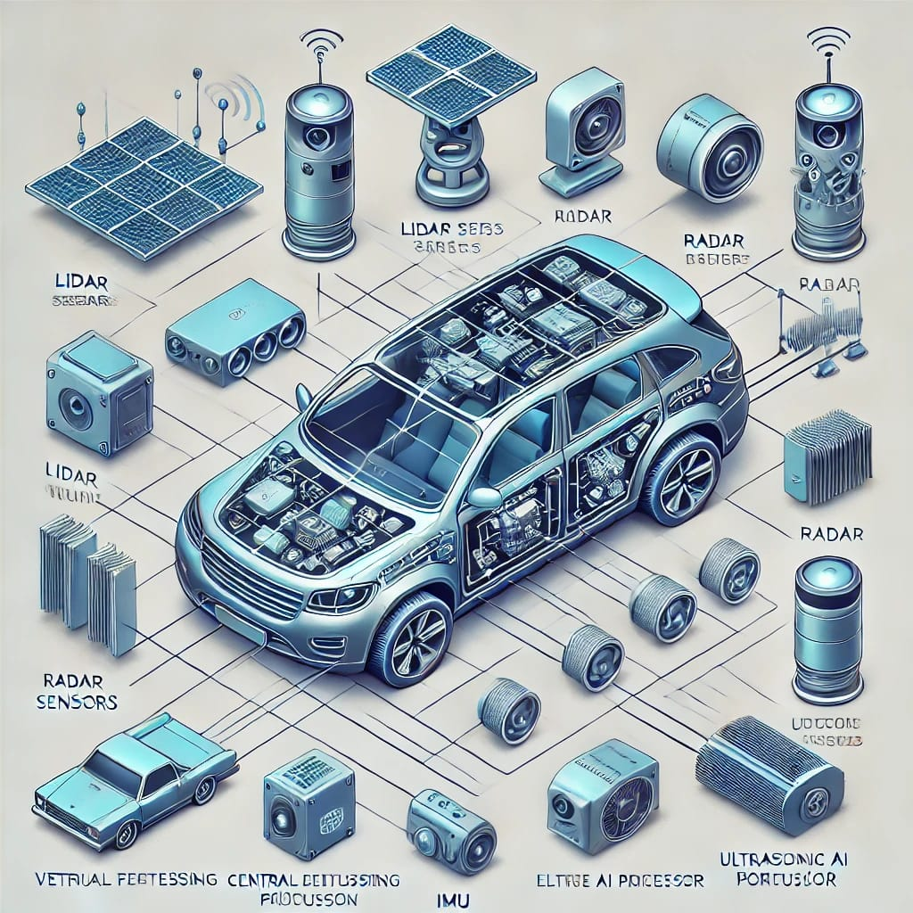

# Autonomous Vehicle Sensor Configuration

## Key Components

•⁠  ⁠*LiDAR Sensors (4-6):* Positioned on the top, front, rear, and sides for 3D mapping and object detection.  
•⁠  ⁠*Radar Sensors (6-8):* Located on the front, rear, and sides for detecting objects and measuring distances.  
•⁠  ⁠*Camera Modules (10-14):* Covering the front, sides, rear, and interior for visual perception.  
•⁠  ⁠*Ultrasonic Sensors (12-16):* Placed around the vehicle for close-range obstacle detection.  
•⁠  ⁠*GPS Module (1):* Provides precise vehicle positioning.  
•⁠  ⁠*IMU (Inertial Measurement Unit) (1):* Tracks motion, acceleration, and rotation.  
•⁠  ⁠*Central AI Processing Unit (2):* Handles decision-making and deep learning computations.  
•⁠  ⁠*Edge AI Processor (1-2):* Processes sensor data in real time for quick responses.  
•⁠  ⁠*V2X Communication Module (1):* Enables vehicle-to-vehicle and vehicle-to-infrastructure communication.  
•⁠  ⁠*5G/LTE Connectivity Module (1):* Supports cloud integration and remote data processing.  
•⁠  ⁠*Vehicle Control Unit (1-2):* Manages acceleration, braking, and steering functions.  
•⁠  ⁠*Fail-Safe Mechanisms:* Ensures emergency interventions for saf# Autonomous Vehicle Sensor Configuration

## System Diagram

